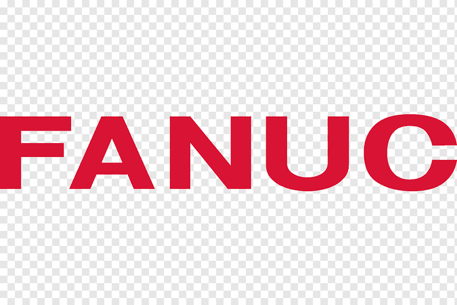

# ECDC Dashboard App - Обзор проекта

## Краткое описание

ECDC Dashboard App - это модульное масштабируемое приложение для управления рабочими станциями и задачами в ECDC. Разработанное с использованием архитектуры клиент-сервер, оно обеспечивает эффективный контроль за производственными процессами, оптимизирует распределение задач и улучшает взаимодействие между разными категориями персонала.

## Цели проекта

- Создание единой платформы для управления рабочими станциями
- Оптимизация распределения и контроля задач (WO)
- Автоматизация рутинных процессов для разных типов операторов
- Интеграция с корпоративными системами (SharePoint 365, BI, Replicon)
- Обеспечение аналитики и визуализации процессов для управления

## Архитектура

### Клиент-серверная модель

Проект использует современную клиент-серверную архитектуру:

- **Серверная часть** (Docker):
  - Централизованное хранение данных
  - REST API для взаимодействия с клиентами
  - Интеграция с внешними системами
  - Бизнес-логика и обработка данных

- **Клиентская часть** (EXE):
  - Интуитивный интерфейс на Flet (Flutter + Python)
  - Адаптация под различные роли пользователей
  - Работа в онлайн и офлайн режимах
  - Установка на рабочие станции операторов

## Ключевые функции

### Для операторов (RO, FA, RM)

- Визуализация расположения рабочих станций и спотов
- Управление заданиями (WO) и отслеживание их статусов
- Таймеры и учет времени работы
- Инструменты автоматизации в зависимости от типа оператора:
  - RO: кастомизация ПО роботов, работа с DAT-файлами
  - FA: специализированные функции для сборки
  - RM: инструменты управления ресурсами

### Для службы поддержки (Support)

- Просмотр статусов всех станций и спотов
- Изменение статусов без вмешательства в задания
- Оповещения о проблемах на станциях

### Для администраторов

- Управление пользователями и ролями
- Конфигурация параметров системы
- Настройка расположения станций методом drag-and-drop
- Мониторинг эффективности процессов

### Демонстрационный режим

- Веб-интерфейс для обзора всей сетки станций
- Цветовая индикация статусов в реальном времени
- Инфографика и аналитические данные
- Мониторинг ключевых показателей эффективности

## Технологический стек

### Серверная часть

- **Язык программирования**: Python 3.10+
- **API Framework**: FastAPI
- **База данных**: PostgreSQL
- **Кэширование**: Redis
- **Контейнеризация**: Docker
- **Интеграция**: SharePoint API, BI API, Replicon API

### Клиентская часть

- **UI Framework**: Flet (Flutter + Python)
- **Упаковка**: PyInstaller / Flet Pack
- **Локальное хранение**: SQLite

## Интеграции

### SharePoint 365

- Получение данных о пользователях
- Синхронизация информации о заданиях (WO)
- Доступ к документам и инструкциям

### BI-сервер

- Получение данных для аналитики
- Отправка статистики выполнения задач
- Формирование отчетов

### Replicon (опционально)

- Учет времени работы
- Синхронизация данных о выполненных задачах
- Анализ эффективности использования рабочего времени

## Преимущества решения

### Для бизнеса

- **Повышение эффективности** - оптимизация распределения задач и ресурсов
- **Улучшение контроля** - мониторинг процессов в реальном времени
- **Снижение времени простоя** - оперативное реагирование на проблемы
- **Аналитика и отчетность** - данные для принятия управленческих решений

### Для пользователей

- **Удобство работы** - интуитивный интерфейс и автоматизация рутинных задач
- **Четкость процессов** - ясное понимание последовательности действий
- **Специализированные инструменты** - функции под конкретные роли
- **Снижение ошибок** - автоматизация проверок и процедур

### Технические преимущества

- **Масштабируемость** - возможность увеличения количества станций и пользователей
- **Модульность** - легкое добавление новых функций
- **Надежность** - отказоустойчивая архитектура
- **Безопасность** - разграничение доступа и защита данных

## Скриншоты

## Дорожная карта

### Фаза 1: Основная функциональность
- Реорганизация проекта на клиент-серверную архитектуру
- Базовый API и клиентское приложение
- Система аутентификации и авторизации
- Управление станциями и спотами

### Фаза 2: Расширенная функциональность
- Разделение по ролям и специализированные инструменты
- Интеграция с SharePoint и BI-сервером
- Администраторский интерфейс
- Улучшения UI/UX

### Фаза 3: Дополнительные возможности
- Демонстрационный режим
- Расширенная аналитика и отчетность
- Интеграция с Replicon
- Оптимизация и масштабирование

## Контакты

**Руководитель проекта**: [Имя Руководителя]
**Email**: project.manager@example.com
**Телефон**: +X XXX XXX XX XX

---

© 2025 ECDC. Все права защищены.
